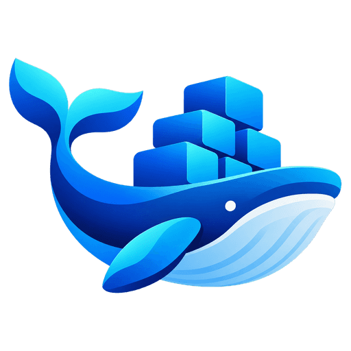

# Docker Manager

One pane of glass for your infrastructure. Run, edit, update and back up the Docker apps on all your servers from one web page, without SSH, a text editor or copying files by hand.

## Quickstart

Follow the [Quickstart](https://docs.neureka.dev/docker-manager/quickstart/).

## Usage

You run the manager once and a small agent on every server you manage. The agent connects out to the manager, so your servers need no open ports. Open your Docker Manager address in a browser, create the owner account, and connect your servers from **Environments**. The [documentation](https://docs.neureka.dev/docker-manager/overview/) walks you through every feature.

## Features

| Feature | What you can do |
|---|---|
| [Stacks](https://docs.neureka.dev/docker-manager/stacks/) | Create, deploy and edit Compose apps, or take over the ones you already run |
| [Containers, images, volumes, networks](https://docs.neureka.dev/docker-manager/containers/) | See and control everything Docker runs on every server |
| [File Manager](https://docs.neureka.dev/docker-manager/file-manager/) | Edit, upload and download the files of stacks and volumes in the browser |
| [Logs](https://docs.neureka.dev/docker-manager/logs/) and [Terminal](https://docs.neureka.dev/docker-manager/terminal/) | Read live logs and open a shell in any container |
| [Updates](https://docs.neureka.dev/docker-manager/updates/) | Find newer images and update your apps, by hand or on a schedule |
| [Backups](https://docs.neureka.dev/docker-manager/backups/) | Back up and restore your apps, their data and Docker Manager itself |
| [Migrations](https://docs.neureka.dev/docker-manager/migrations/) | Move a stack, a volume, a whole server or Docker Manager itself to another server |
| [Templates](https://docs.neureka.dev/docker-manager/templates/) | Save an app once and create new stacks from it |
| [Users & Groups](https://docs.neureka.dev/docker-manager/users-and-groups/) and [Permissions](https://docs.neureka.dev/docker-manager/permissions/) | Invite people and decide what each of them may see and do |

## Requirements

| Requirement | Details |
|---|---|
| Server | Linux on amd64 or arm64 |
| Docker | Docker Engine 25.0 or newer with the Compose plugin |
| Address | A domain name and a reverse proxy that serves it over HTTPS |

Docker Desktop, rootless Docker, the Docker built into NAS systems and Docker Swarm are not supported. See [Configuration](https://docs.neureka.dev/docker-manager/configuration/) for every setting and [Troubleshooting](https://docs.neureka.dev/docker-manager/troubleshooting/) when something goes wrong.

## Versioning

There are no versioned releases yet. The `main` branch publishes the `edge` images `ghcr.io/neurekadev/docker-manager:edge` and `ghcr.io/neurekadev/docker-agent:edge`. [Upgrade](https://docs.neureka.dev/docker-manager/quickstart/#upgrade) from the app with **Pull & Deploy**.

## Why Use Docker Manager?

- **Everything in one place:** every server, stack, file, log and backup behind one sign-in.
- **No shell needed:** deploy, edit files, read logs and upgrade from the browser.
- **Safe by default:** outbound-only agents, two-factor sign-in, fine-grained permissions and an audit log.
- **Your data stays yours:** self-hosted, with encrypted backups to your own storage.
